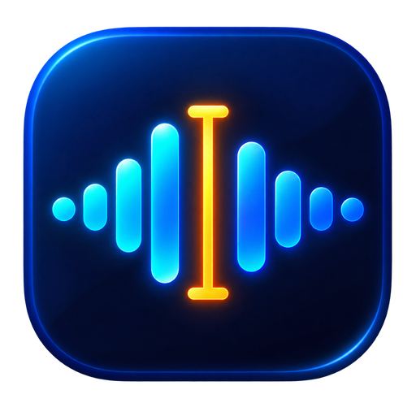
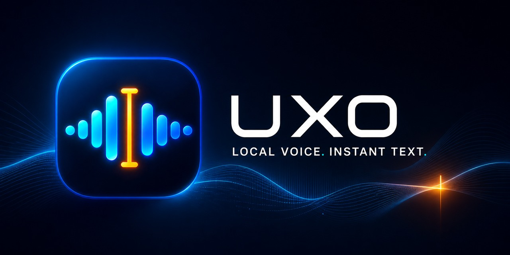

<p align="right">
  <strong>English</strong> · <a href="docs/README.ru.md">Русский</a>
</p>

<p align="center">
  
</p>



<p align="center">
  <a href="https://github.com/bglglzd/uxo/releases/download/v0.1.1/UXO_0.1.1_x64-setup.exe"></a>
</p>

<p align="center">
  <a href="https://github.com/bglglzd/uxo/releases/tag/v0.1.1"></a>
  
  
  <a href="LICENSE"></a>
</p>

# UXO

UXO is a fast, private desktop dictation app. Press a global shortcut, speak, and UXO transcribes locally before pasting clean Unicode text into whichever app has focus.

> [!WARNING]
> **v0.1.1 is an unsigned Windows x64 Preview.** Windows SmartScreen may display an “Unknown publisher” warning. Download only from the [official UXO release](https://github.com/bglglzd/uxo/releases/tag/v0.1.1) and verify the file against its published [SHA-256 checksums](https://github.com/bglglzd/uxo/releases/download/v0.1.1/SHA256SUMS.txt).

## Why UXO

- **Keeps the GPU free.** The Windows Preview deliberately uses CPU-only speech recognition, so dictation remains available while a game or creative app occupies the GPU.
- **Keeps ordinary dictation local.** Microphone audio and core speech recognition stay on the computer; no ASR cloud account is required.
- **Stays out of the way.** After first-run setup, UXO can launch with Windows, start hidden, and live in the system tray.
- **Responds quickly.** The selected model remains resident and model/VAD prewarming happens asynchronously after startup.
- **Pastes the text you meant.** UXO inserts Unicode through the Windows clipboard rather than emulating layout-dependent keystrokes, so Russian text does not turn into Latin-keyboard gibberish.
- **Adapts to the workflow.** Use hold-to-talk or toggle recording, choose the microphone and language, and switch between Nemotron, Whisper, Parakeet, and other compatible local models.

## Get started

1. **[Download UXO v0.1.1 for Windows x64](https://github.com/bglglzd/uxo/releases/download/v0.1.1/UXO_0.1.1_x64-setup.exe).** An MSI package is also available on the [release page](https://github.com/bglglzd/uxo/releases/tag/v0.1.1).
2. Run the installer. Because this Preview is not code-signed, Windows may ask you to review an unknown-publisher warning.
3. Complete onboarding and download a speech model. Models are not bundled with the installer.
4. Put the caret in any text field, press the configured shortcut, and speak.

Fresh profiles enable launch at login and start hidden after onboarding. The shortcut, push-to-talk behavior, autostart, microphone, model, transcription language, sounds, history, and paste behavior all remain configurable in Settings.

## Local-first pipeline

```text
global shortcut → microphone → silence filtering → local ASR → Unicode clipboard paste
```

The core path does not send microphone audio to a speech-recognition service. After a selected model has been downloaded, ordinary dictation can run without an internet connection.

## Models and language coverage

The recommended Windows model is the Q8 GGUF build of [NVIDIA Nemotron 3.5 ASR Streaming 0.6B](https://huggingface.co/nvidia/nemotron-3.5-asr-streaming-0.6b). Its download is approximately **751 MB**, happens separately during setup, and is not part of the installer. It supports cache-aware streaming and is the default balance of responsiveness, multilingual coverage, and CPU use for this Preview.

Whisper-family and other local models remain available for different accuracy, language, memory, and latency trade-offs. Speech-language support comes from the selected model and is separate from the language used by UXO's interface.

### Speech recognition

The recommended Nemotron model provides **32 out-of-the-box locales across 28 base languages**:

English, Spanish, French, Italian, Portuguese, Dutch, German, Turkish, Russian, Arabic, Hindi, Japanese, Korean, Vietnamese, Ukrainian, Polish, Swedish, Czech, Norwegian Bokmål, Danish, Bulgarian, Finnish, Croatian, Slovak, Mandarin Chinese, Hungarian, Romanian, and Estonian.

English, Spanish, French, and Portuguese include multiple regional locales, bringing the total from 28 base languages to 32 locales. Model quality varies by language, accent, microphone, and acoustic environment; other models in the catalog have their own coverage.

### Interface

UXO currently ships **24 interface languages**:

English, Simplified Chinese, Traditional Chinese, Spanish, French, German, Japanese, Korean, Vietnamese, Polish, Italian, Russian, Ukrainian, Portuguese, Czech, Turkish, Arabic, Hebrew, Swedish, Bulgarian, Dutch, Nepali, Hindi, and Danish.

English is the canonical project documentation. The full Russian translation is available in [docs/README.ru.md](docs/README.ru.md). Translation contributions are welcome; see [CONTRIBUTING_TRANSLATIONS.md](CONTRIBUTING_TRANSLATIONS.md).

## Privacy boundary

UXO's default recording and transcription path is local, but the complete privacy boundary is worth stating precisely:

- The first model download and future model downloads require a network connection and are retrieved from their respective model hosts.
- History and retained recordings can be written to local storage according to the user's settings.
- Optional LLM post-processing is a separate, opt-in feature. When configured and invoked, it sends transcript text to the selected remote provider under that provider's terms. It does not form part of the local/offline guarantee.
- In this Preview, configured provider endpoints and API keys are stored in the app's local settings in plaintext rather than in a dedicated operating-system credential vault. Use scoped, revocable keys and do not configure remote post-processing on an untrusted shared Windows account.

## Command-line controls

UXO is normally controlled from the tray and global shortcut, but its single-instance command-line interface is useful for scripts and launchers:

```text
uxo --start-hidden
uxo --toggle-transcription
uxo --toggle-post-process
uxo --cancel
uxo --debug
```

Runtime flags do not overwrite the corresponding saved settings.

## Build from source

Prerequisites:

- the latest stable [Rust](https://rustup.rs/) toolchain;
- [Bun](https://bun.sh/);
- Visual Studio C++ build tools and a Windows SDK;
- CMake and Ninja for native speech dependencies.

Install the frontend dependencies. The development VAD model is already tracked at `src-tauri/resources/models/silero_vad_v4.onnx`:

```powershell
bun install
```

Run the quality checks:

```powershell
bun run build
bun run lint
bun run check:translations
bun run format:check
cargo test --manifest-path src-tauri/Cargo.toml --lib
```

Native Windows builds require the verified MSVC, Visual Studio CMake, and Ninja environment described in [BUILD.md](BUILD.md). In particular, ensure that an unrelated MinGW CMake installation does not take precedence on `PATH`.

## Preview scope

- The downloadable release currently targets **Windows x64**. macOS and Linux development paths exist, but they are not qualified UXO v0.1.1 release targets.
- Windows inference is intentionally CPU-only in this Preview. GPU acceleration may return later as an explicit opt-in mode.
- The installer is not code-signed and there is no signed production update channel yet.
- Administrator-input compatibility elevates the full UXO process for one session; use it only on a trusted personal installation and only while needed.
- Language quality varies, and current performance notes are not a substitute for a broad real-world accuracy benchmark.
- Optional remote post-processing has the privacy and local-secret-storage caveats described above.

Please report reproducible UXO problems through the repository's [issue tracker](https://github.com/bglglzd/uxo/issues). For development guidance, see [CONTRIBUTING.md](CONTRIBUTING.md).

## Documentation

- [Architecture](docs/ARCHITECTURE.md)
- [Initial Nemotron performance probe](docs/BENCHMARKS.md)
- [v0.1.1 release notes](docs/releases/v0.1.1.md)
- [v0.1.0 release notes](docs/releases/v0.1.0.md)
- [Third-party software and model notices](THIRD_PARTY_NOTICES.md)

## License

The source code is available under the [MIT License](LICENSE). Third-party components and separately downloaded model weights retain their respective licenses and terms; see [THIRD_PARTY_NOTICES.md](THIRD_PARTY_NOTICES.md).
